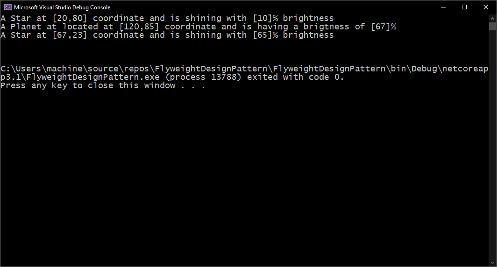

# Flyweight Design Pattern C# Implementation

Let us build up a NET Core C# console application to implement the Flyweight Design Pattern using a simple example. The requirement of the application is defined as follows:

## Requirement Description

Assuming we are building a small gaming application to represent stars and planets in the galaxy. Here every star and planet will be positioned by the client application during the play. The characteristics of the stars and the planet objects are as follow:

1. All the stars and planets will be elliptical in shape and of the same size. Star will be of size 10×10 and the size of the planet will be 30×30.
2. The color of the stars will be blue and that of the planet will be red.
3. The position and the brightness of the stars will be provided by the client during the runtime.
4. The client can create a large number of stars and planet objects.
5. The application will be used in a mobile application and memory (RAM) is a major constraint.

As per requirement, let us try to fit the requirement using the Flyweight Design Pattern. Let us break Star and the planet object’s properties into Intrinsic and Extrinsic state first.

1. Intrinsic Objects: These values are common across all the stars and planet objects and they are not going to change.
   - Shape and size.
   - The color of the Stars always is blue and the of a planet is red.
2. Extrinsic Objects: These are the values that will be provided by the client during runtime and will be unique across the star and planet objects.
   - Position of the star and a planet.
   - The brightness of the star and planet.
   
## Application Output 

 The details can be found at the following blog post link: **https://executecommands.com/flyweight-design-pattern-csharp-simple-example/**
